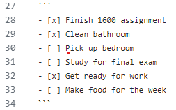

As stated in the previous page, I'll be showing you how to create lists using markdown 

It's kinda hard to show an input and output since markdown likes to freak out when a list is inside a list. Either that or I'm doing something wrong. 

This right here is how you create a table in all its guts and glory.
```
| Text | More Text |
| ----------- | ----------- |
| One | Two |
| Three | Four |
```
And here is what it'll look like when its not in the code bubble. 
| Text | More Text |
| ----------- | ----------- |
| One | Two |
| Three | Four |

Now lets move to making lists! It'll look like this when it's displayed on the page. 
- [x] Finish 1600 assignment
- [x] Clean bathroom
- [ ] Pick up bedroom
- [ ] Study for final exam
- [x] Get ready for work
- [ ] Make food for the week

I'll show you what the code looks like now.
```
- [x] Finish 1600 assignment
- [x] Clean bathroom
- [ ] Pick up bedroom
- [ ] Study for final exam
- [x] Get ready for work
- [ ] Make food for the week
```
It's really simple but it's fast just to copy and paste the - [ ] and dont forget the space in the middle and the x if you want to mark it. 

You were problably wondering how I'm able to have those bubbles show the internal code too. Its really easy. You just put three ` on two different lines and the code in the middle. 
It's a little hard to show so I'll put in an image instead. <br> 

<br>
Another neat thing that you can do is copy whatever is inside the bubble with the coopt button at the top right. Kinda fun so you cna test it yourself if you're having issues.<br> 

Speaking of images, lets talk about imbeds. 

[Home](https://github.com/EricGutierrezAVG/MarkdownFinal/blob/main/README.md)
